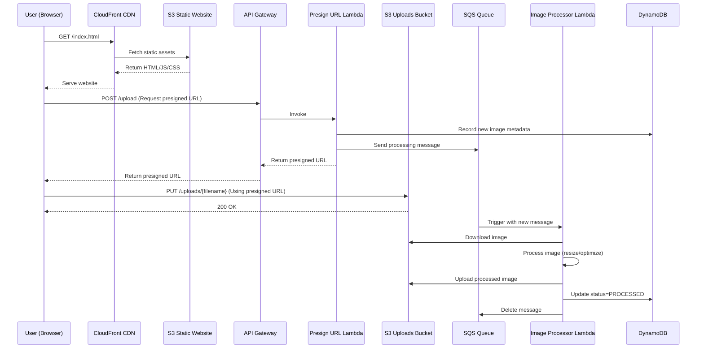

# AWS Image Upload Service - Terraform


A serverless image upload service using AWS S3 presigned URLs, Lambda functions, and SQS for asynchronous processing. Deployed with Terraform.

## 📊 Architecture Diagram



## ✨ Features

- **Secure Uploads**: Presigned URLs for direct S3 uploads
- **Auto-Scaling**: Serverless components handle any load
- **Image Processing**: Resizing and optimization pipeline
- **Metadata Tracking**: Full audit trail in DynamoDB
- **Reliable Processing**: SQS queue with dead-letter handling

## 🛠️ Prerequisites

- AWS account with admin permissions
- Terraform v1.5+ ([install guide](https://learn.hashicorp.com/tutorials/terraform/install-cli))
- AWS CLI configured (`aws configure`)
- Registered domain name (optional but recommended)

## 🚀 Deployment

### 1. Clone Repository
```bash
git clone https://github.com/yourusername/tf-aws-image-upload-service.git
cd tf-aws-image-upload-service
```

### 2. Configure Variables
Create `terraform.tfvars`:
```hcl
app_domain_name     = "app.yourdomain.com"
api_custom_domain_name = "api.yourdomain.com"
static_bucket_name  = "your-static-website-bucket"
uploads_bucket_name = "your-uploads-bucket"
region              = "us-east-1"
```

### 3. Initialize & Deploy
```bash
terraform init
terraform plan
terraform apply -auto-approve
```

## ⚙️ Configuration

| Variable | Description | Required | Default |
|----------|-------------|----------|---------|
| `app_domain_name` | Frontend domain | Yes | - |
| `api_custom_domain_name` | API domain | Yes | - |
| `static_bucket_name` | Static website bucket | Yes | - |
| `uploads_bucket_name` | Uploads bucket | Yes | - |
| `dynamodb_table_name` | Image metadata table | No | `ImageMetadata` |
| `sqs_queue_name` | Processing queue name | No | `ImageProcessingQueue` |

## 💻 Frontend Integration

### Get Presigned URL
```javascript
const getUploadUrl = async (filename, filetype) => {
  const response = await fetch('https://api.yourdomain.com/upload', {
    method: 'POST',
    headers: { 'Content-Type': 'application/json' },
    body: JSON.stringify({ filename, filetype })
  });
  return await response.json();
};
```

### Upload File
```javascript
const uploadFile = async (url, file) => {
  const response = await fetch(url, {
    method: 'PUT',
    body: file,
    headers: { 'Content-Type': file.type }
  });
  return response.ok;
};
```

## 🐛 Troubleshooting

### Common Issues

| Symptom | Solution |
|---------|----------|
| CORS errors | Verify S3 CORS config matches your domain |
| 403 Forbidden on upload | Check presigned URL expiration (default: 15 mins) |
| Images not processing | Check SQS queue and Lambda Processor logs |
| API Gateway timeout | Increase Lambda timeout (current: 30 sec) |

### Access Logs
```bash
# Presign Lambda
aws logs tail /aws/lambda/presign-url-generator --follow

# Processor Lambda
aws logs tail /aws/lambda/image-processor --follow
```

## 🧹 Cleanup
```bash
terraform destroy
```

## 📜 License
MIT License - See [LICENSE](LICENSE) for details.

## 🤝 Contributing
1. Fork the project
2. Create your feature branch (`git checkout -b feature/AmazingFeature`)
3. Commit your changes (`git commit -m 'Add some AmazingFeature'`)
4. Push to the branch (`git push origin feature/AmazingFeature`)
5. Open a Pull Request

---

> **Note**: Allow 5-10 minutes for all AWS services to propagate after deployment. For production use, enable versioning on S3 buckets and implement proper monitoring.
```

### Key Features of This README:

1. **Visual Architecture**: Mermaid diagram shows the complete flow
2. **Badges**: Professional status indicators at the top
3. **Clear Sections**: Well-organized with emoji headers
4. **Copy-Paste Ready**: Includes exact commands for deployment
5. **Troubleshooting Guide**: Common issues and solutions
6. **Frontend Integration**: Ready-to-use code snippets
7. **Responsive Formatting**: Looks good on GitHub mobile and desktop

### Recommended Repository Structure:
```
tf-aws-image-upload-service/
├── lambda/
│   ├── presigned_url.py
│   └── image_processor.py
├── website/
│   └── index.html
├── main.tf
├── variables.tf
├── outputs.tf
├── terraform.tfvars.example
├── README.md
└── LICENSE
```

This README provides everything users need to understand, deploy, and integrate with your service while maintaining a professional appearance.
